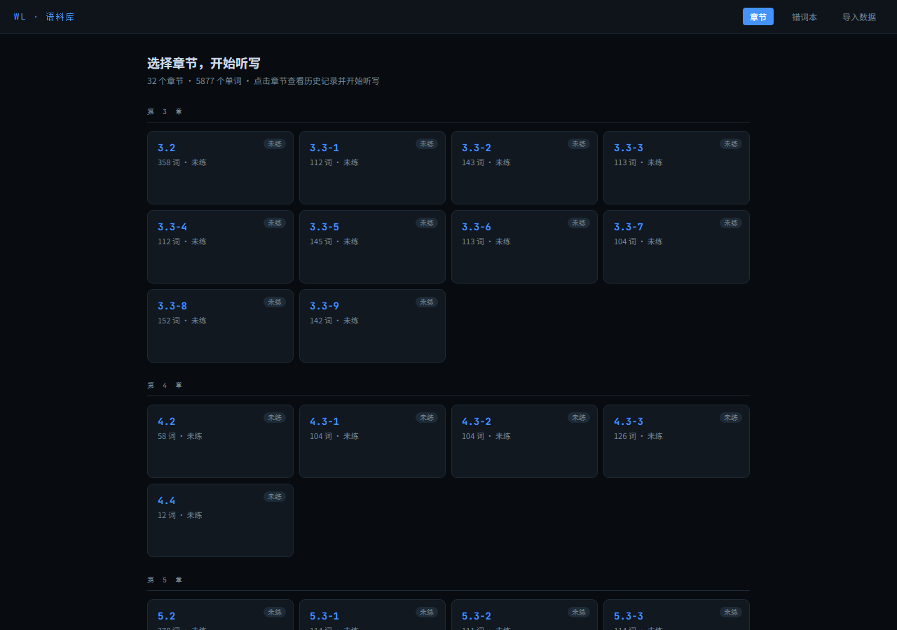
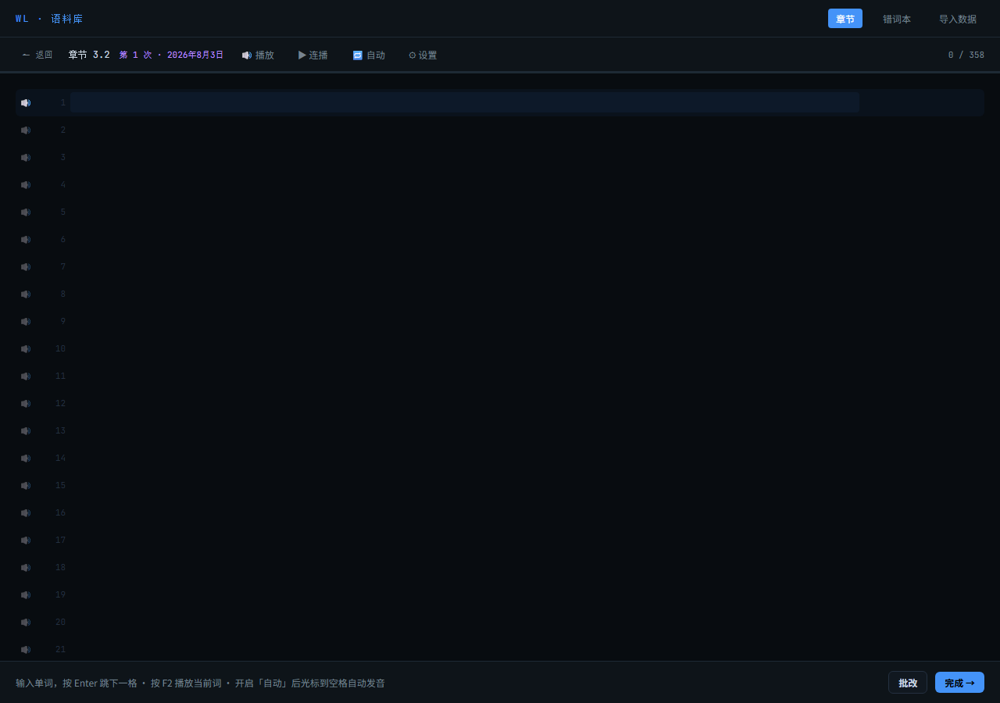

# 王陆语料库听写练习工具

一个为雅思听力备考设计的单词听写练习网页，基于王陆语料库（剑桥雅思真题词汇）。

**在线使用** → [点击这里](https://pipitang233.github.io/wanglu-dictation-app/)

> 本项目 fork 自 [zyxlele/wanglu-dictation](https://github.com/zyxlele/wanglu-dictation)，在原版基础上新增内置发音模块与乱序测试。词汇数据版权归原作者（王陆老师/出版社）所有，工具仅限个人学习、非商用。

---

## 功能

- 📚 **8 个章节，5877 个单词**（剑桥雅思真题第 3、4、5、11 章）
- 🔊 **内置发音模块**：无需外部音频，点击行内喇叭、按 F2 或开启自动播放即可听音
- ✍️ **流畅听写模式**：所有单词一次列出，配合发音边听边打，Enter 跳下一格，不打断节奏
- 🎲 **乱序测试**：每个章节可一键打乱单词顺序听写，防止背顺序，成绩计入历史并标注「乱序」
- 📈 **历史记录**：记录每次听写的日期、第几次、正确率，折线图展示进步趋势
- 🔍 **历史详情**：可回看每次听写的错词和全部答题情况
- 📒 **错词本**：按章节分组，自动收录所有历史错词，支持针对单章节或全部错词重练
- 💾 **本地存储**：数据保存在浏览器 localStorage，无需账号，无需联网

---

## 发音功能

- **逐词播放**：点击任意一行的 🔊 按钮，或把光标移到该行后按 **F2**
- **连播**：点击顶栏 **▶ 连播**，从第一个未答词开始按设定间隔自动朗读，模拟书配套音频
- **自动播放**：开启 **🔁 自动** 后，光标移到空格即自动发音
- **发音设置（⚙）**：
  - 语速：慢 / 正常 / 快
  - 每词重复次数：1 / 2 / 3
  - 连播间隔：1s / 2s / 3s
  - 发音方式：**合成语音**（默认，离线可用，自动优先英音）/ **真人发音**（联网获取单词真实发音并缓存，短语自动回退合成语音）

> 发音设置保存在浏览器 localStorage，刷新或下次打开自动恢复。

---

## 使用方法

### 方法一：直接下载使用
1. 下载本仓库的 `王陆语料库听写练习_v5.html`
2. 双击用浏览器打开，即可使用（无需安装任何东西）

### 方法二：在线使用
访问上方的在线链接（需先按下文步骤开启 GitHub Pages）

---

## 适合谁用

- 正在备考雅思，使用王陆语料库练习听力词汇
- 不想依赖外部录音设备，希望网页内置发音直接听写
- 希望追踪自己每个章节的听写正确率变化

---

## 开启 GitHub Pages（在线访问）

1. 进入仓库 → **Settings** → 左侧 **Pages**
2. Source 选 **Deploy from a branch**
3. Branch 选 **main**，文件夹选 **/ (root)**
4. 点 **Save**，等 1-2 分钟，访问 `https://pipitang233.github.io/wanglu-dictation/` 即可

---

## 数据说明

所有词汇数据来源于王陆老师的雅思语料库，版权归原作者所有，本工具仅供个人学习使用。
用户的听写记录保存在**本地浏览器**的 localStorage 中，不会上传至任何服务器。

---

## 版本迁移

如果你有旧版本的听写记录想迁移到新版，打开网页后点导航栏的**「导入数据」**按照提示操作。

---

## 更新记录

### v1.3（最新）

**批改结果视图**

- 听写完成结果页新增「错题 / 全部批改」切换：可只看错题，也可查看全部单词的批改结果（✓/✗ 与填写内容）

### v1.2

**乱序测试**

- 章节详情页新增「乱序测试 →」按钮，与「开始听写」并列
- 复用听写界面与发音模块，本章单词随机打乱顺序出题
- 成绩照常计入章节历史与正确率趋势，历史记录和详情弹窗标注「乱序」
- 结果页提供「重测（乱序）」按钮，每次重新随机；错词同样自动收入错词本

### v1.1

**内置发音模块**

- 听写页新增 🔊 播放 / ▶ 连播 / 🔁 自动 / ⚙ 设置 四个按钮，每行单词带独立小喇叭
- 逐词播放：点击行内喇叭或按 F2 播放当前词
- 连播模式：从第一个未答词开始按设定间隔自动朗读，模拟书配套音频
- 自动模式：光标移到空格即自动发音
- 设置项：语速（慢/正常/快）、每词重复（1-3 次）、连播间隔（1-3 秒）、发音方式（合成语音/真人发音），自动保存到浏览器
- 新增 index.html 跳转页，便于 GitHub Pages 访问

**发音修正与兼容**

- 修正 TTS 把短语中独立单词 "a" 读成字母音 "A" 的问题（如 "a great variety of" 现在读 "uh"）；大写 "A"（如 "A plus"）保留字母读音
- 修正数据疑似笔误 "OHPEN" → 读作 "open"
- 语音选择优先本地离线英音；语音静默失败自动切换下一个可用语音
- Chrome 无本地英文语音时（如只有 Google 联网语音），自动切换到有道/Google 词典英音 mp3 播放，解决国内网络下 Chrome 无声音的问题
- 真人发音模式：单词走真人录音（首次联网获取并缓存），短语自动回退合成语音；接口不可用时自动回退
- 设置面板新增「🔊 测试语音」按钮，方便排查无声问题

**兼容性说明**

- 合成语音：优先使用浏览器本地英音（离线可用）；无本地语音时使用联网词典发音（需要网络）
- 真人发音：需要网络；仅在 ⚙ 设置中切换到「真人发音」后生效
- 推荐浏览器：Chrome / Edge
